# 🚗 AutoGallery — Kurumsal Araç Yönetimi ve Galeri Platformu

<div align="center">


</div>

**AutoGallery**, otomotiv sektörüne yönelik geliştirilmiş; modern, güvenli ve minimalist bir mimariyi benimseyen kurumsal bir araç alım-satım ve galeri yönetim platformudur. Hem son kullanıcılar için şeffaf bir vitrin hem de galeri yöneticileri için güçlü ve sezgisel bir kontrol paneli sunar.

---

## 📸 Ekran Görüntüleri

### 🖥️ Yönetim Paneli (Admin Dashboard)
| Yönetim Paneli Özeti | Araç Yönetimi |
| :---: | :---: |
| 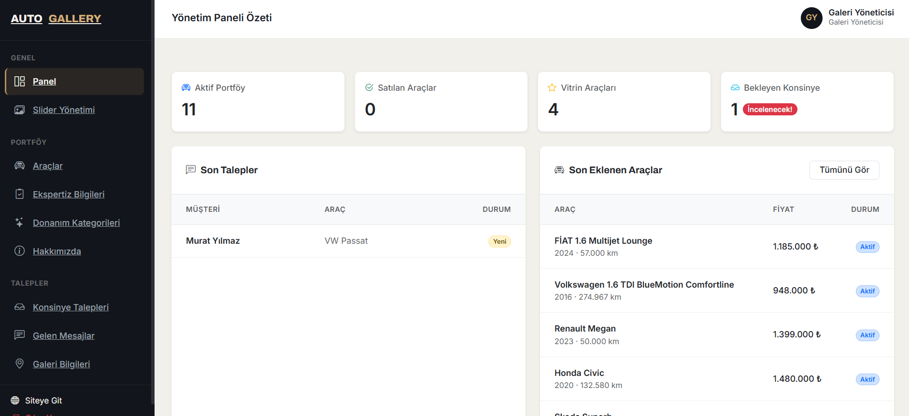 | 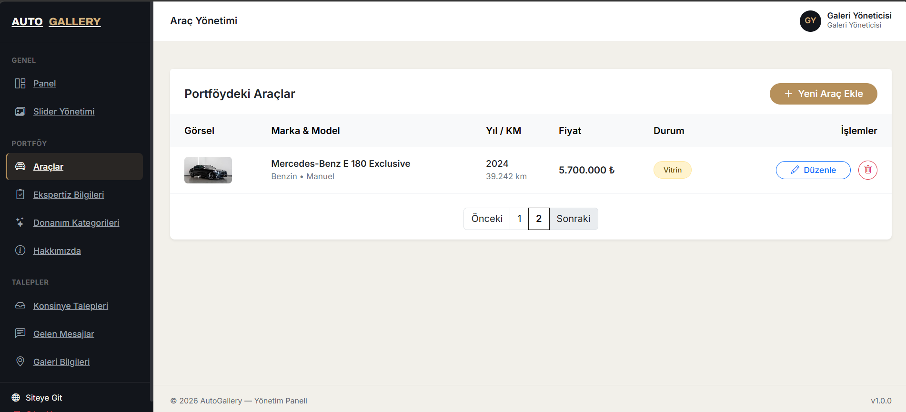 |

| Slider Yönetimi | Donanım Kategorileri |
| :---: | :---: |
| 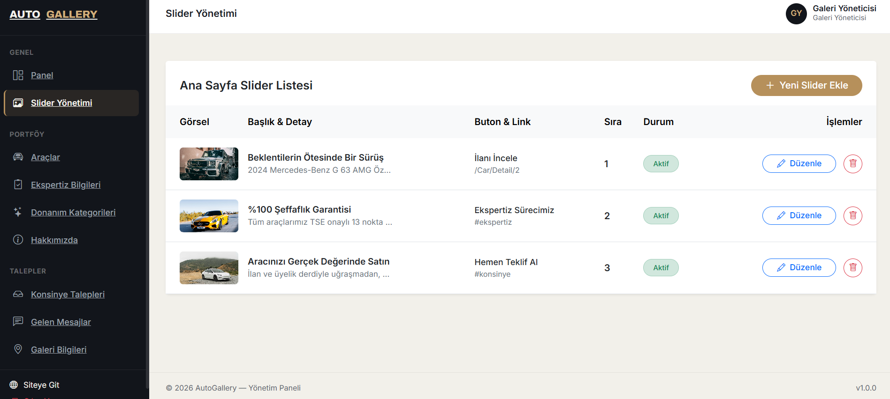 | 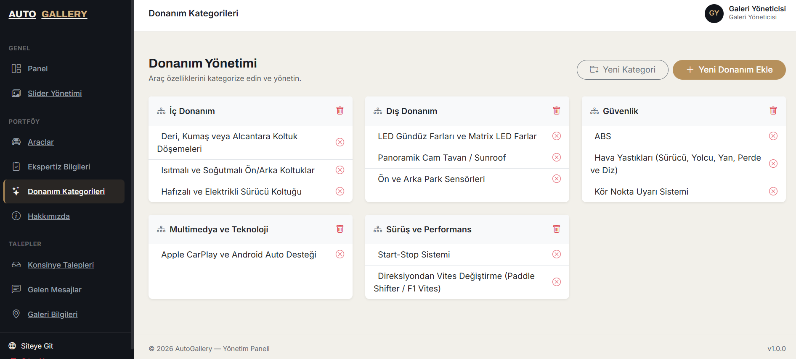 |

### 🌐 Müşteri Arayüzü & Vitrin
| Ana Sayfa & Slider | Öne Çıkan Araçlar |
| :---: | :---: |
| 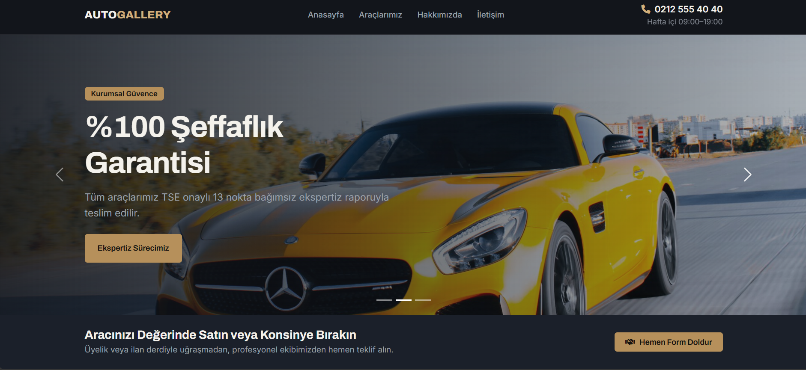 | 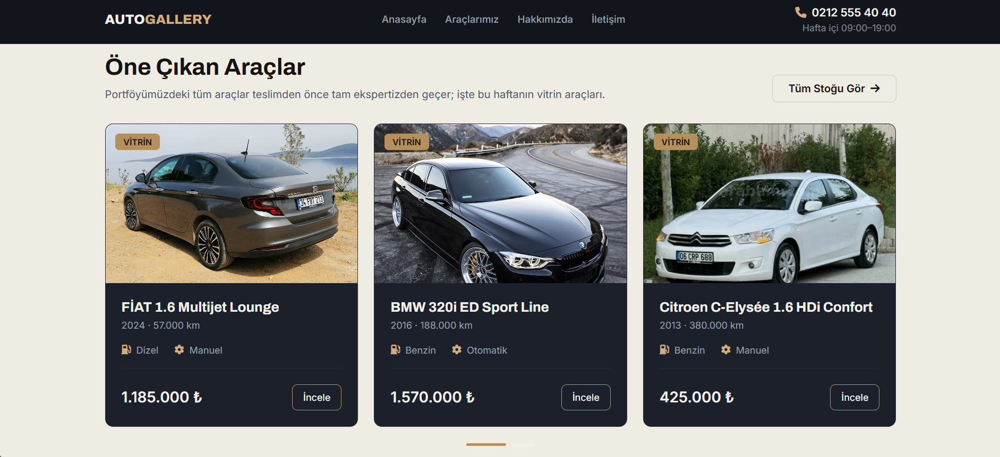 |

| Araç Listeleme & Filtreleme | Araç Detay & Özet |
| :---: | :---: |
| 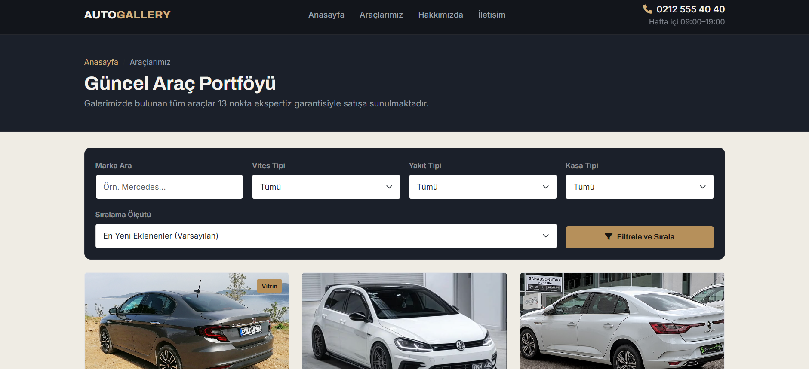 | 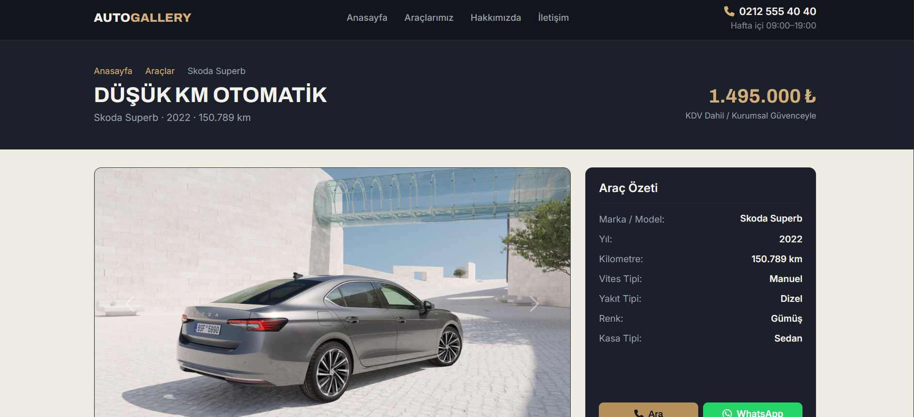 |

| 13 Nokta Ekspertiz Analizi | Donanım ve Özellikler |
| :---: | :---: |
| 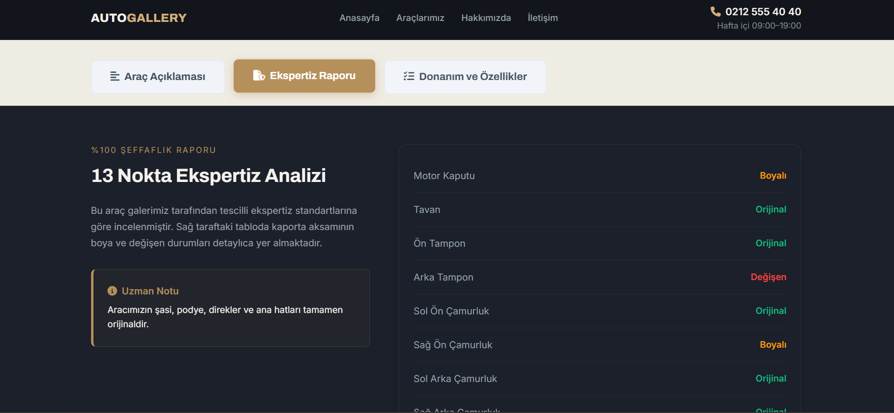 | 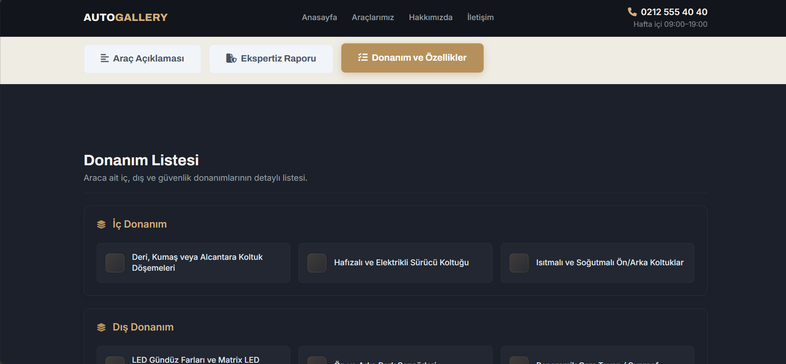 |

| Kurumsal Hakkımızda | Konsinye / Araç Satış Formu | İletişim ve Konum |
| :---: | :---: | :---: |
| 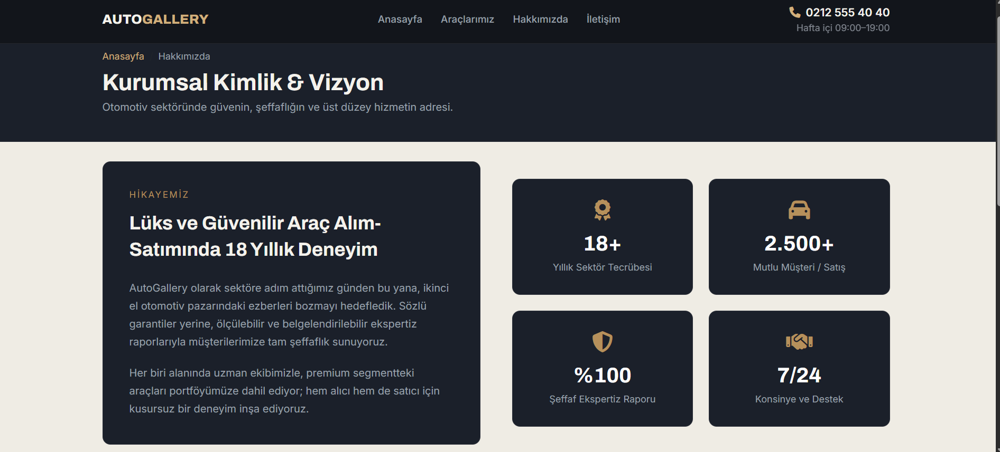 | 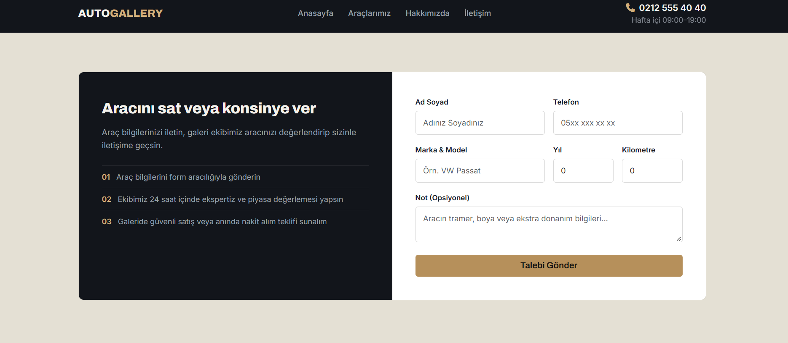 | 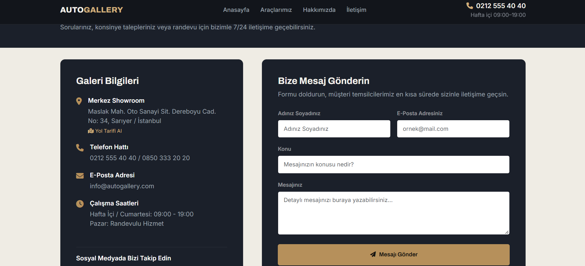 |

---

## 🛠️ Mimari ve Teknolojiler

Proje, endüstri standartlarına uygun olarak katmanlı bir yapıda geliştirilmiştir:

* **Backend:** ASP.NET Core 8.0, C#, LINQ, Entity Framework Core (ORM)
* **Veritabanı:** PostgreSQL
* **Kimlik Doğrulama (Authentication):** Cookie-Based Authentication (Güvenli çerez yönetimi, Claims tabanlı yetkilendirme)
* **Frontend & UI:** HTML5, CSS3, Bootstrap 5, Bootstrap Icons, Özel Koyu Tema (Dark Mode) Tasarım Sistemi
* **Veri Doğrulama:** DataAnnotations (`[Required]`, `[StringLength]`, vb.) ve ViewModel validasyonları

---

## 🚀 Projenin Öne Çıkan Özellikleri

* **Güvenli Yönetici Paneli:** Veritabanına bağlı (`DbInitializer` ile otomatik ilk kurulum) dinamik admin hesabı ve şifreli çerez tabanlı oturum yönetimi.
* **Gelişmiş Filtreleme:** Marka, vites tipi, yakıt tipi ve kasa tipine göre hızlı araç arama ve sıralama mekanizması.
* **13 Nokta Şeffaf Ekspertiz Raporu:** Her araç için detaylı kaporta, boya ve mekanik durum analizi gösterimi.
* **Konsinye & İletişim Talepleri:** Müşterilerin araçlarını galeriye satmak veya konsinye bırakmak için kullanabileceği entegre form altyapısı.
* **Dinamik Yönetim Modülleri:** Admin panelinden slider yönetimi, araç portföyü, donanım kategorileri ve kurumsal bilgilerin kolayca yönetilebilmesi.

---

## ⚙️ Kurulum ve Çalıştırma

Projeyi yerel ortamınızda çalıştırmak için aşağıdaki adımları izleyebilirsiniz:

1. **Repoyu Klonlayın:**
   ```bash
   git clone [https://github.com/kullaniciadi/autogallery.git](https://github.com/kullaniciadi/autogallery.git)
   ```
2. **Veritabanı Bağlantısını Ayarlayın:**
appsettings.json dosyasındaki ConnectionStrings alanını kendi PostgreSQL sunucu bilgilerinize göre güncelleyin.

3. **Veritabanını Güncelleyin (Migration & Seed):**
Package Manager Console veya terminal üzerinden şu komutları çalıştırın:
```bash
dotnet ef database update
```
(Uygulama ilk ayağa kalktığında DbInitializer otomatik olarak ilk admin hesabını oluşturacaktır).

4. **Projeyi Çalıştırın:**
```bash
dotnet run --project AutoGallery.WebUI
```

---

## 🔑 Yönetici Giriş Bilgileri (Test)
Yönetim paneline erişmek için /Account/Login adresine gidebilir ya da doğrudan /Admin sayfasına yönlendirilebilirsiniz:

- Kullanıcı Adı: admin

- Şifre: gallery2026

---

## 📄 Lisans
Bu proje MIT lisansı altında lisanslanmıştır.

---

## Geliştirici: EnessCode